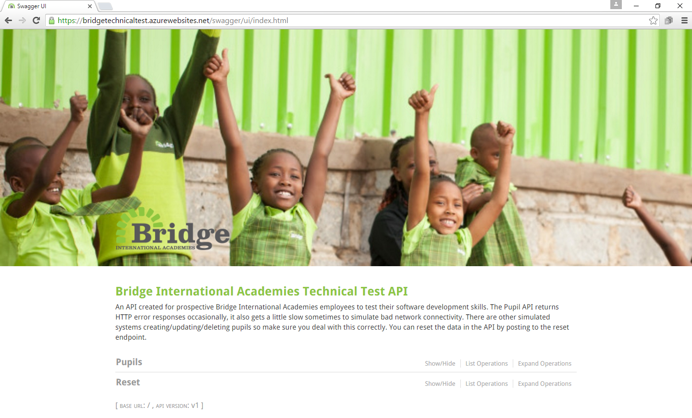

# Android Technical Test

## Objective

Below are a set of requirements from a business owner within Bridge International Academies, relating to a need to be able to administer pupil information from a mobile application.  The basic framework of the application already exists, but needs to be extended with the some or all of the given requirements.

We assess a number of things including the design of your solution and your programming skills. While these are small problems, we expect you to submit what you believe is production-quality code – code that you’d be able to run, maintain, and evolve, including any tests that you would normally write as part of the development process. You don’t need to gold plate your solution; you do not have to complete all requirements; please submit when you are happy that you have demonstrated your ability to deliver within the alloted time frame.

As a general rule, we allow three days from the date that you receive these instructions to submit your code, but you may request more time if needed. It is not required that all requirements are completed within this time period.  Please submit the exercise when you are happy with that you have demonstrated 

If you have any questions about the code as it relates to your interview process, please contact us.

## Technical Test API

The Technical Test API is a RESTful web service that makes uses of basic HTTP GET, POST, PUT and DELETE calls. The API documentation can be accessed [here](https://androidtechnicaltestapi-test.bridgeinternationalacademies.com/swagger/index.html).

### Swagger

Upon visiting the API documentation page, you will see the following page where you can see a short description of the API, followed by the resources it provides and a list of all the actions that can be performed on them. You can also try out the API directly from the web browser. The API exposes a standard [Swagger](http://swagger.io/) endpoint.

### Real World Simulation

The API attempts to simulate real world usage in several ways:

1. Occasionally real web services go down due to any number of reasons. The Technical Test API will occasionally throw errors. Your app will need to deal with this.
2. To simulate bad network connectivity or the server being under intense load, the Technical Test API will sometimes take a few seconds to respond.
3. To simulate other users creating, updating and deleting data the Technical Test API will sometimes create, update or delete pupils from its internal database.

### Validation

Pupils have several fields, including Name, Country, Image, Latitude and Longitude. To insert or update a pupil, these fields values must be valid for the Technical Test API to accept them. If they are invalid the API will return a standard 400 Bad Request error response.

## App Requirements

The requirements from the business owner are:

1. I need to be able to see a list of all pupils.
2. I need to be able to add a new pupil and submit.
3. The above requirements should continue when I am offline.  With data synchronising when I'm next online.

In addition, you should also:

1. Write a short ReadMe about your code, your design, assumptions made and which requirements are implemented.
2. Write production quality code.
3. Submit your source code as a .zip file. Also, do not include any binary files in your final solution.

## Good Luck!